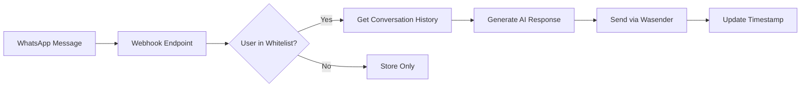

# WhatsApp AI Bot - Features & Implementation Guide

> **Complete feature documentation for the WhatsApp AI Bot API**  
> _Last Updated: October 7, 2025_

## Table of Contents

- [Overview](#overview)
- [Core Features](#core-features)
- [AI Auto-Response System](#ai-auto-response-system)
- [API Quick Reference](#api-quick-reference)
- [Database Schema](#database-schema)
- [Implementation Details](#implementation-details)
- [Testing](#testing)
- [Configuration](#configuration)
- [Migration Guide](#migration-guide)
- [Troubleshooting](#troubleshooting)

---

## Overview

The WhatsApp AI Bot provides intelligent, automated responses to WhatsApp messages through a **database-driven whitelist system**. Key capabilities include:

✅ **Dynamic User Management** - Add/remove AI-enabled users via API  
✅ **Context-Aware Responses** - Uses conversation history for relevant replies  
✅ **Azure OpenAI GPT-4o** - Powered by state-of-the-art AI  
✅ **Automatic Message Sending** - Responses delivered via Wasender API  
✅ **Real-Time Control** - Enable/disable AI per user without code changes  
✅ **Comprehensive Analytics** - Track interactions and usage patterns

---

## Core Features

### 1. WhatsApp Webhook Processing

- Receives and processes WhatsApp messages
- Stores messages with full metadata in SQLite database
- Supports text, extended text, emoji, group, and newsletter messages
- Phone number extraction from remoteJid

### 2. AI Auto-Response System

**Database-Driven Whitelist:**

- Control which users receive AI responses
- No keyword required (unlike legacy "Andrew" system)
- Fine-grained per-user control
- Real-time enable/disable

**Intelligent Processing:**

- Retrieves last 20 messages for context
- Generates conversational responses using GPT-4o
- Sends responses automatically via Wasender API
- Tracks interaction timestamps

### 3. Message Management

- Query messages by session, contact, or content
- Search with full-text capabilities
- Date range filtering
- Statistics and analytics

### 4. AI Chat & Analysis

- Direct Azure OpenAI integration
- Conversation analysis and summarization
- Customizable parameters (temperature, tokens)
- Multi-turn conversations

### 5. Outbound Messaging

- Send individual messages
- Bulk message support
- Message formatting and emoji support
- API token management

---

## AI Auto-Response System

### How It Works



### Implementation Flow

1. **User Management** - Add users to AI whitelist via API
2. **Message Reception** - Webhook receives WhatsApp message
3. **User Check** - Query database: `isAIEnabled(remoteJid)`
4. **Context Retrieval** - Fetch last 20 messages if enabled
5. **AI Processing** - Generate response using GPT-4o with context
6. **Response Delivery** - Send via Wasender API
7. **Tracking** - Update `last_interaction` timestamp

### Code Example

```javascript
// Webhook Processing (server.js ~line 406)
const isAIEnabled = await db.isAIEnabled(originalData.remoteJid);

if (isAIEnabled) {
  // Get conversation history
  const history = await db.getMessagesByContact(originalData.remoteJid, 20);

  // Generate AI response
  const aiResponse = await getChatCompletion(conversationHistory, {
    temperature: 0.7,
    max_tokens: 200,
  });

  // Send response
  await sendWhatsAppMessage(sessionId, remoteJid, aiResponse.message);

  // Update interaction timestamp
  await db.updateAIUserInteraction(originalData.remoteJid);
}
```

---

## API Quick Reference

### AI User Management Endpoints

#### Add User to Whitelist

```http
POST /ai-users/add
Content-Type: application/json

{
  "remoteJid": "256703722777@s.whatsapp.net",
  "name": "John Doe",
  "phoneNumber": "+256703722777",
  "notes": "VIP customer - priority support"
}
```

**Response:**

```json
{
  "status": "success",
  "message": "User added successfully",
  "user": {
    "remoteJid": "256703722777@s.whatsapp.net",
    "enabled": true
  }
}
```

#### List All AI-Enabled Users

```http
GET /ai-users
GET /ai-users?includeDisabled=true
```

#### Check If User Is AI-Enabled

```http
GET /ai-users/check/256703722777@s.whatsapp.net
```

**Response:**

```json
{
  "remoteJid": "256703722777@s.whatsapp.net",
  "isEnabled": true
}
```

#### Get User Details

```http
GET /ai-users/256703722777@s.whatsapp.net
```

#### Toggle User Status

```http
PUT /ai-users/256703722777@s.whatsapp.net/toggle
```

#### Remove User (Soft Delete)

```http
DELETE /ai-users/256703722777@s.whatsapp.net/remove
```

#### Delete User Permanently

```http
DELETE /ai-users/256703722777@s.whatsapp.net/delete
```

### Command Line Examples

```bash
# Add user
curl -X POST http://localhost/ai-users/add \
  -H "Content-Type: application/json" \
  -d '{
    "remoteJid": "256703722777@s.whatsapp.net",
    "name": "Test User"
  }'

# List users
curl http://localhost/ai-users

# Check user status
curl http://localhost/ai-users/check/256703722777@s.whatsapp.net

# Toggle status
curl -X PUT http://localhost/ai-users/256703722777@s.whatsapp.net/toggle
```

---

## Database Schema

### ai_enabled_users Table

```sql
CREATE TABLE ai_enabled_users (
    id INTEGER PRIMARY KEY AUTOINCREMENT,
    remoteJid TEXT NOT NULL UNIQUE,
    phoneNumber TEXT,
    name TEXT,
    enabled BOOLEAN DEFAULT 1,
    notes TEXT,
    last_interaction DATETIME,
    created_at DATETIME DEFAULT CURRENT_TIMESTAMP,
    updated_at DATETIME DEFAULT CURRENT_TIMESTAMP
);

-- Indexes for performance
CREATE INDEX idx_ai_users_remoteJid ON ai_enabled_users(remoteJid);
CREATE INDEX idx_ai_users_phoneNumber ON ai_enabled_users(phoneNumber);
CREATE INDEX idx_ai_users_enabled ON ai_enabled_users(enabled);

-- View for easy querying
CREATE VIEW ai_enabled_users_view AS
SELECT
    remoteJid,
    phoneNumber,
    name,
    enabled,
    notes,
    datetime(last_interaction, 'localtime') as last_interaction_local,
    datetime(created_at, 'localtime') as created_at_local,
    datetime(updated_at, 'localtime') as updated_at_local
FROM ai_enabled_users;
```

### Field Descriptions

| Field              | Type     | Description                        |
| ------------------ | -------- | ---------------------------------- |
| `id`               | INTEGER  | Auto-incrementing primary key      |
| `remoteJid`        | TEXT     | WhatsApp identifier (unique)       |
| `phoneNumber`      | TEXT     | Extracted phone number (optional)  |
| `name`             | TEXT     | User's display name (optional)     |
| `enabled`          | BOOLEAN  | AI response status (default: true) |
| `notes`            | TEXT     | Additional user information        |
| `last_interaction` | DATETIME | Last AI response timestamp         |
| `created_at`       | DATETIME | User addition timestamp            |
| `updated_at`       | DATETIME | Last modification timestamp        |

### Common Queries

```sql
-- Get all enabled users
SELECT * FROM ai_enabled_users WHERE enabled = 1;

-- Get recent interactions
SELECT remoteJid, name, last_interaction
FROM ai_enabled_users
WHERE enabled = 1
ORDER BY last_interaction DESC
LIMIT 10;

-- Count users
SELECT
  COUNT(*) as total,
  SUM(CASE WHEN enabled THEN 1 ELSE 0 END) as enabled,
  SUM(CASE WHEN NOT enabled THEN 1 ELSE 0 END) as disabled
FROM ai_enabled_users;

-- Find inactive users (no interaction in 7 days)
SELECT * FROM ai_enabled_users
WHERE enabled = 1
AND (last_interaction IS NULL OR last_interaction < datetime('now', '-7 days'));
```

---

## Implementation Details

### Database Helper Methods

**8 new methods added to `db-helper.js`:**

1. **`isAIEnabled(remoteJid)`** - Check if user should receive AI responses
2. **`addAIUser(remoteJid, data)`** - Add user to whitelist (upsert)
3. **`removeAIUser(remoteJid)`** - Soft delete (disable user)
4. **`deleteAIUser(remoteJid)`** - Permanently delete user
5. **`toggleAIUser(remoteJid)`** - Toggle enabled status
6. **`getAIUsers(includeDisabled)`** - List all users
7. **`getAIUser(remoteJid)`** - Get specific user details
8. **`updateAIUserInteraction(remoteJid)`** - Update last_interaction timestamp

### Webhook Logic

**Before (Deprecated Keyword System):**

```javascript
if (messageText.toLowerCase().startsWith("andrew")) {
  // Process AI response
}
```

**After (Current Database-Driven System):**

```javascript
const isAIEnabled = await db.isAIEnabled(originalData.remoteJid);
if (isAIEnabled) {
  // Process AI response
  await db.updateAIUserInteraction(originalData.remoteJid);
}
```

### API Endpoints Implementation

**7 new endpoints added to `server.js`:**

- `POST /ai-users/add` - Add user to whitelist
- `GET /ai-users` - List all users
- `GET /ai-users/check/:remoteJid` - Check AI status
- `GET /ai-users/:remoteJid` - Get user details
- `PUT /ai-users/:remoteJid/toggle` - Toggle status
- `DELETE /ai-users/:remoteJid/remove` - Soft delete
- `DELETE /ai-users/:remoteJid/delete` - Hard delete

---

## Testing

### Test Files

| File                     | Tests | Purpose                   |
| ------------------------ | ----- | ------------------------- |
| `rest/04-ai-users.http`  | 35+   | REST Client test suite    |
| `test-ai-users.js`       | 10    | Automated database tests  |
| `rest/01-webhook.http`   | 25+   | Webhook integration tests |
| `rest/06-workflows.http` | 30+   | End-to-end scenarios      |

### Quick Test

```bash
# 1. Add a test user
POST http://localhost/ai-users/add
{
  "remoteJid": "test@s.whatsapp.net",
  "name": "Test User"
}

# 2. Verify addition
GET http://localhost/ai-users

# 3. Send test webhook
POST http://localhost/webhook
{
  "event": "messages.received",
  "sessionId": "test_session",
  "data": {
    "messages": {
      "remoteJid": "test@s.whatsapp.net",
      "message": {
        "conversation": "Hello, how are you?"
      }
    }
  }
}

# 4. Check interaction updated
GET http://localhost/ai-users/test@s.whatsapp.net
```

### Automated Tests

```bash
# Run database tests
node test-ai-users.js

# Expected output:
# ✅ User addition with full details
# ✅ User addition with minimal details
# ✅ Check if user is AI-enabled
# ✅ Get user details
# ✅ List all AI-enabled users
# ✅ Update interaction time
# ✅ Toggle user status
# ✅ Check disabled user
# ✅ Re-enable disabled user
# ✅ Non-existent user returns false
```

---

## Configuration

### Required Environment Variables

```bash
# Azure OpenAI Configuration
AZURE_OPENAI_ENDPOINT=https://your-resource.openai.azure.com/
AZURE_OPENAI_API_KEY=your_api_key_here
AZURE_OPENAI_DEPLOYMENT_NAME=your_gpt4o_deployment
AZURE_OPENAI_API_VERSION=2024-12-01-preview
AZURE_OPENAI_MODEL=gpt-4o

# AI Response Configuration (Optional)
MAX_TOKENS=1500
TEMPERATURE=0.7

# Wasender API Configuration
WASENDER_API_TOKEN=your_wasender_token_here
```

### AI Response Parameters

| Parameter       | Default | Description               |
| --------------- | ------- | ------------------------- |
| `temperature`   | 0.7     | Creativity level (0-1)    |
| `max_tokens`    | 200     | Maximum response length   |
| `history_limit` | 20      | Messages used for context |

---

## Migration Guide

### From Keyword-Based System

If you're migrating from the old "Andrew" keyword system:

#### What Changed

**Old System:**

- Users typed "Andrew, help me..."
- Any user could trigger AI with keyword
- No control over who gets responses
- Hardcoded trigger word

**New System:**

- Admin adds users to whitelist via API
- Only whitelisted users get AI responses
- Users send normal messages (no keyword)
- Database-driven control

#### Migration Steps

1. **Database Setup** ✅

   ```bash
   npm run bootstrap
   # Creates ai_enabled_users table
   ```

2. **Identify Active Users**

   ```sql
   -- Find users who used "Andrew" keyword
   SELECT DISTINCT remoteJid, pushName
   FROM whatsapp_messages
   WHERE message LIKE 'andrew%' OR message LIKE 'Andrew%'
   ORDER BY created_at DESC;
   ```

3. **Add Users to Whitelist**

   ```bash
   # For each active user:
   curl -X POST http://localhost/ai-users/add \
     -H "Content-Type: application/json" \
     -d '{"remoteJid":"USER_JID","name":"USER_NAME"}'
   ```

4. **Restart Server**

   ```bash
   npm start
   # New endpoints will be active
   ```

5. **Verify**

   ```bash
   # Check whitelisted users
   curl http://localhost/ai-users

   # Test with webhook
   # (see Testing section above)
   ```

6. **Update Documentation** ✅
   - Remove references to "Andrew" keyword
   - Update user guides with new process

---

## Troubleshooting

### AI Responses Not Working

**Problem:** User not receiving AI responses

**Solutions:**

1. Check if user is whitelisted:

   ```bash
   curl http://localhost/ai-users/check/USER_REMOTE_JID
   ```

2. Add user if missing:

   ```bash
   curl -X POST http://localhost/ai-users/add \
     -H "Content-Type: application/json" \
     -d '{"remoteJid":"USER_REMOTE_JID"}'
   ```

3. Check if user is enabled:

   ```sql
   SELECT * FROM ai_enabled_users
   WHERE remoteJid = 'USER_REMOTE_JID';
   ```

4. Verify Azure OpenAI configuration:
   ```bash
   # Test AI endpoint directly
   curl -X POST http://localhost/ai/chat \
     -H "Content-Type: application/json" \
     -d '{"message":"test"}'
   ```

### Database Issues

**Problem:** Database errors or user not found

**Solutions:**

1. Verify table exists:

   ```bash
   sqlite3 libraries/database/whatsapp_messages.db ".tables"
   # Should show: ai_enabled_users
   ```

2. Recreate table if missing:

   ```bash
   npm run bootstrap
   ```

3. Check table structure:
   ```sql
   .schema ai_enabled_users
   ```

### API Endpoint Errors

**Problem:** 404 Not Found on /ai-users endpoints

**Solutions:**

1. Restart server:

   ```bash
   npm start
   ```

2. Verify endpoints are loaded:

   ```bash
   # Should return 200 OK
   curl http://localhost/health
   ```

3. Check server logs for startup errors

### Performance Issues

**Problem:** Slow AI responses

**Solutions:**

1. Check Azure OpenAI quota and limits
2. Reduce `history_limit` from 20 to 10 messages
3. Decrease `max_tokens` for faster responses
4. Monitor database query performance:
   ```sql
   EXPLAIN QUERY PLAN
   SELECT * FROM ai_enabled_users WHERE remoteJid = ?;
   ```

---

## Advantages of Database-Driven Approach

✅ **No Code Deployment** - Add/remove users via API  
✅ **Fine-Grained Control** - Enable AI per user  
✅ **Audit Trail** - Track additions and interactions  
✅ **Scalability** - Manage thousands of users  
✅ **Flexibility** - Toggle on/off without data loss  
✅ **Better UX** - No trigger words required  
✅ **Analytics** - Query patterns and usage  
✅ **Security** - Controlled access to AI features

---

## Future Enhancements

- [ ] User groups with different AI personalities
- [ ] Rate limiting per user (messages/day)
- [ ] Custom AI prompts per user
- [ ] Conversation summaries storage
- [ ] User preference management
- [ ] Analytics dashboard
- [ ] Multi-language support
- [ ] Role-based access control for endpoints

---

## Resources

- **Main Documentation:** `../README.md`
- **API Tests:** `../rest/04-ai-users.http`
- **Database Setup:** `../libraries/database/setup.sql`
- **Helper Methods:** `../libraries/database/db-helper.js`
- **Server Implementation:** `../server.js`

---

**Status:** ✅ **PRODUCTION READY**

_All features implemented, tested, and documented. System is stable and scalable._
